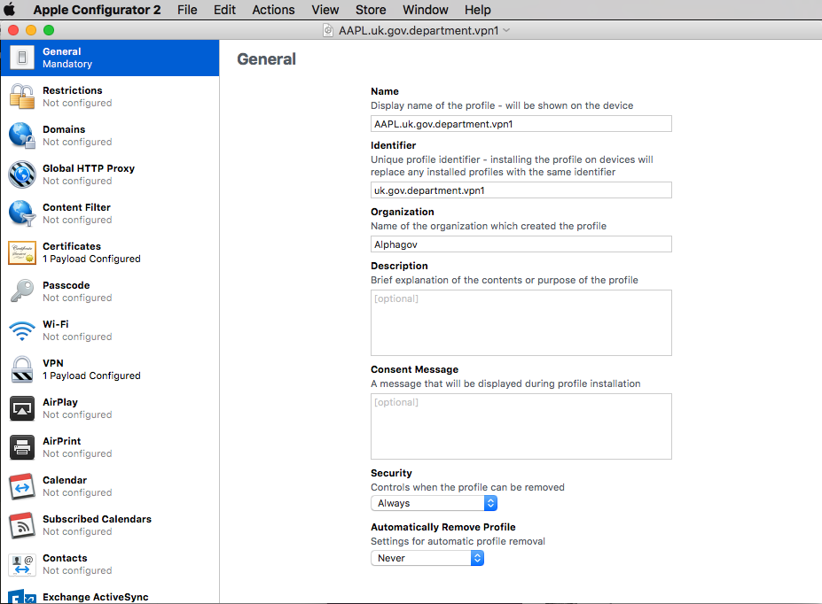
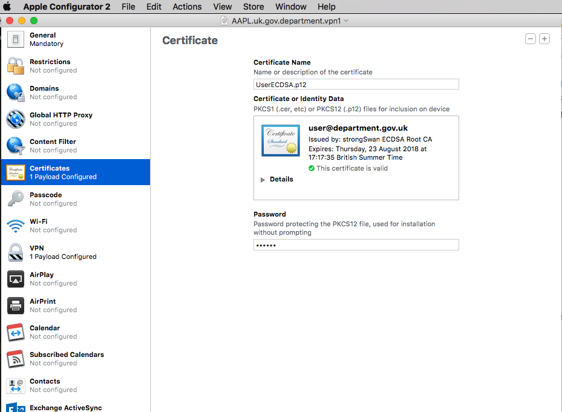
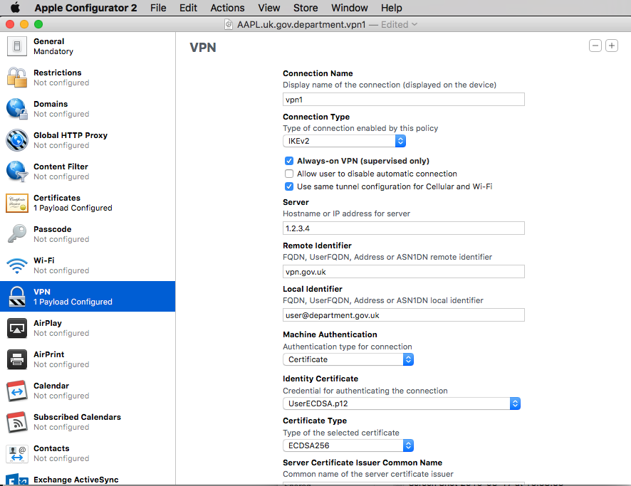
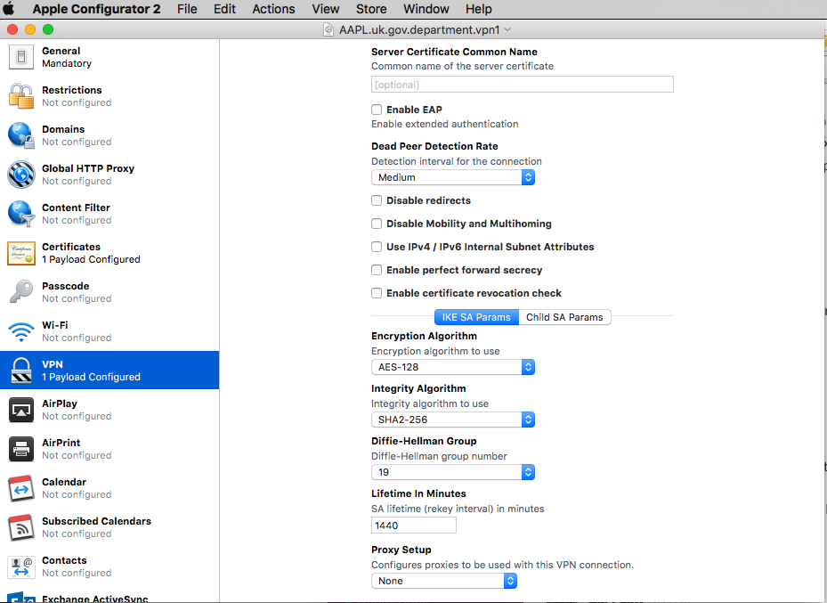
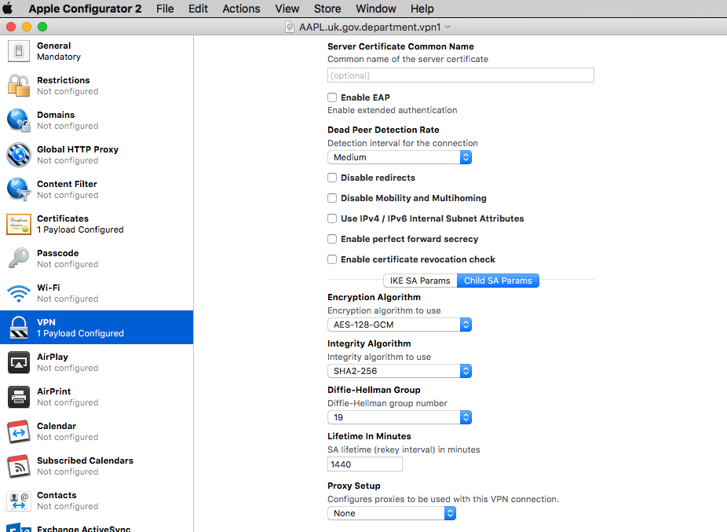

# Instructions for configuring Apple devices

Some settings for VPNs are not available in the standard macOS or iOS user interfaces, including the 'always on' option.  To create a suitable VPN connection on iOS or macOS you can use the Apple Configurator or a similar tool to create a profile, the profile can then be installed by hand by an administrator, or through an MDM solution.

These settings are simply for this demonstration, a real production installation may require more configuration.

If you select the 'always on' option the profile can only be installed on a supervised device.  It will fail to install on non-supervised devices, if you’d like to allow this create another profile without 'always on' selected.

# Create a new profile

Create a new profile, and give it a descriptive name.

# Add the .p12 

Add the certificate bundle in the .p12 file.  You can also add the .pem file seperately.

# Configure a VPN

There are lots of settings to change here from the defaults.  You may need to scroll down to find all the options, and both the IKE SA and Child SA configurations need to be set.  Remote Identifier _must_ match a SAN name on the firewall; local _must_ match the local cert name.

# Use the profile

Save the profile — it’s an .xml file.  It can be installed on macOS or iOS.
